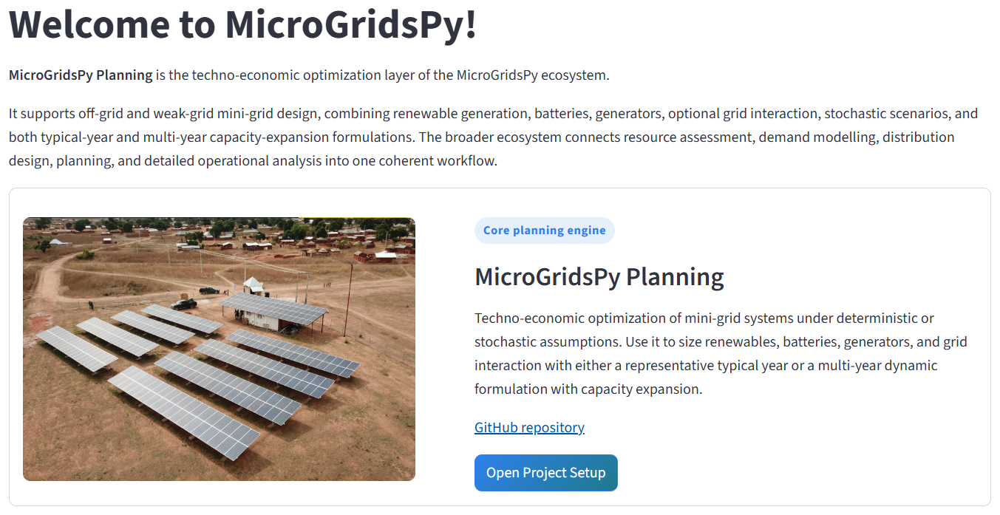

# MicroGridsPy Planning - Streamlit Optimization Tool

MicroGridsPy Planning is an open-source optimization tool for the techno-economic planning of mini-grid energy systems in remote and underserved areas. The application is built in Python with Streamlit for the user interface and Linopy for mathematical optimization.

The tool is designed as a guided planning workspace: users define a project, generate structured input templates, audit the data, run the optimization, and explore results within the same application.

The reference energy system can include:
- Renewable generation
- Battery storage
- Backup generators
- Optional grid connection
- Optional grid export

The app supports both simple and advanced studies, including:
- Typical-year and multi-year formulations
- Single-scenario and multi-scenario analyses
- Continuous and discrete sizing
- Optional carbon-cost internalization
- Renewable land constraints
- Capacity expansion over time

Each project is stored in its own folder with CSV, YAML, and JSON files, so studies remain reproducible, inspectable, and easy to revisit.



---

## Installation

The recommended setup uses Anaconda or Miniconda.

### 1. Create and activate an environment

```bash
conda create -n mgpy_planning python=3.11
conda activate mgpy_planning
```

### 2. Install the main dependencies

```bash
conda install -c conda-forge streamlit pandas numpy xarray matplotlib pyyaml
pip install linopy
```

### 3. Install a solver

At least one solver is required.

For HiGHS:

```bash
conda install -c conda-forge highspy
```

For Gurobi, install the Python package and make sure a valid license is available:

```bash
pip install gurobipy
```

### 4. Launch the app

From the repository root:

```bash
streamlit run Home.py
```

If the app was already open while you installed new dependencies, restart Streamlit so the environment is reloaded.

---

## What The App Does

MicroGridsPy Planning combines project setup, input-template generation, data audit, optimization, and result interpretation in a single interface.

It is intended to support a complete workflow:
1. Define the structure of the planning problem.
2. Generate the input templates required by that problem.
3. Fill and validate the CSV and YAML inputs.
4. Solve the optimization model.
5. Inspect design, dispatch, cost, and reliability results.

This makes the tool useful both for early-stage feasibility studies and for more detailed long-term planning exercises.

---

## Intended Workflow And User Experience

The application is organized as a sequence of Streamlit pages that progressively define, validate, solve, and interpret a planning problem.

### 1. Project Setup

The first page defines the global structure of the study:
- Off-grid or on-grid configuration
- Technologies included in the system
- Typical-year or multi-year formulation
- Deterministic or multi-scenario setup
- Economic and policy settings
- Optional modelling features such as carbon cost or discrete sizing

These choices determine the shape of the optimization problem and the set of input templates generated for the user.

### 2. Input Template Generation

Based on the selected configuration, the application creates structured templates tailored to the project:
- CSV files for time series
- YAML files for techno-economic parameters
- JSON settings for workflow and formulation choices

This helps keep user inputs consistent with the actual model dimensions and enabled technologies.

### 3. Data Audit And Visualization

Before optimization, the user can inspect and validate the generated inputs through:
- Dataset structure summaries
- Parameter overviews
- Optimization-constraint summaries
- Time-series visualizations
- Grid availability checks for on-grid systems

This step is useful for detecting mistakes before solving.

### 4. Optimization

The optimization page builds and solves the mathematical model using:
- HiGHS
- Gurobi

The model computes the least-cost system design and dispatch subject to the selected technical, economic, and policy constraints.

### 5. Results

The results page provides access to:
- Optimal capacities
- Dispatch plots
- Energy-balance views
- Cost breakdowns
- Emissions indicators
- Reliability metrics
- Scenario-dependent outputs

For multi-year studies, the app also supports year-by-year and investment-step interpretation.

---

## Planning Modes

MicroGridsPy Planning supports two complementary formulations.

### Typical-Year Planning

The typical-year formulation represents the system with a single representative year.

It is most appropriate when:
- Demand and resource conditions are assumed to be stationary
- Capacity expansion is not required
- A compact, computationally efficient model is preferred

The objective is based on expected equivalent annual cost, combining annualized investment costs and expected operating costs.

### Multi-Year Planning

The multi-year formulation represents the system over an explicit planning horizon.

It is most appropriate when:
- Demand evolves over time
- Capacity expansion is relevant
- Degradation, replacement, and investment timing matter
- Long-term trade-offs need to be assessed explicitly

The objective is based on expected net present cost and includes the time value of money, operating costs, and remaining asset value where applicable.

---

## Main Modeling Features

Depending on project setup, the application can represent:
- Off-grid and on-grid systems
- Optional grid export
- Renewable, battery, and generator investment
- Generator partial-load efficiency curves
- Scenario-weighted uncertainty
- Land-use limits for renewables
- Lost-load constraints and penalties
- Minimum renewable penetration targets
- Carbon-cost inclusion in the objective
- Continuous sizing or discrete unit-based sizing
- Capacity expansion over multiple investment stages

---

## Input Structure

Each project is stored under its own folder and typically contains:

### Core configuration
- `formulation.json`

### Time-series inputs
- `load_demand.csv`
- `resource_availability.csv`
- `grid_import_price.csv`
- `grid_export_price.csv`
- `grid_availability.csv`

### Technology inputs
- `renewables.yaml`
- `battery.yaml`
- `generator.yaml`
- `generator_efficiency_curve.csv`
- `grid.yaml`

The exact set of files depends on whether the project is typical-year or multi-year, off-grid or on-grid, and whether optional features such as export or partial-load modeling are enabled.

---

## Solvers

Supported optimization solvers:
- `HiGHS`: open-source and recommended as the default option
- `Gurobi`: commercial solver, useful for harder MILP cases or larger studies

If you select HiGHS in the app, make sure the `highspy` package is installed in the active environment.

---

## Contacts

For questions, feedback, or collaboration:

- Alessandro Onori - `alessandro.onori@polimi.it`
